# NeuroGrid

<p align="center">
  
</p>

<p align="center">
  A dual-surface energy intelligence workspace with a React dashboard for live operations and a FastAPI digital twin for simulation and status capture.
</p>

<p align="center">
  
</p>

## What lives here

- `DASHBOARD/` - Vite + React operations dashboard with monitoring, analytics, reports, simulations, and settings.
- `DIGITAL TWIN/` - FastAPI backend plus React frontend for the simulation and status layer.

## Highlights

- Live-style dashboard navigation for assets, monitoring, analytics, simulations, reports, and settings.
- FastAPI status endpoints backed by MongoDB for digital twin events and health capture.
- A visual identity built around layered grid forms, glowing edges, and motion cues.

## Visual Preview

<table>
  <tr>
    <td align="center">
      
    </td>
    <td align="center">
      
    </td>
  </tr>
</table>

## Project Layout

```text
NeuroGrid
├─ DASHBOARD
└─ DIGITAL TWIN
   ├─ backend
   └─ frontend
```

## Quick Start

### Dashboard

```bash
cd DASHBOARD
npm install
npm run dev
```

### Digital Twin

```bash
cd "DIGITAL TWIN/backend"
pip install -r requirements.txt
uvicorn server:app --reload
```

```bash
cd "DIGITAL TWIN/frontend"
npm install
npm start
```

## Notes

- The animated banner is an inline SVG asset, so it works in Markdown viewers without extra dependencies.
- The dashboard hero image is reused from the existing project assets to keep the README grounded in the current UI.